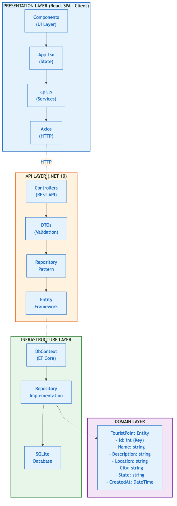
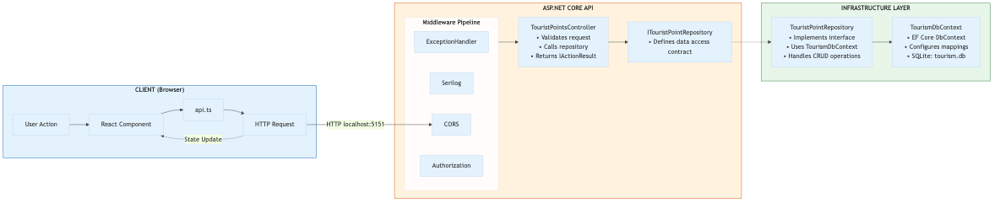
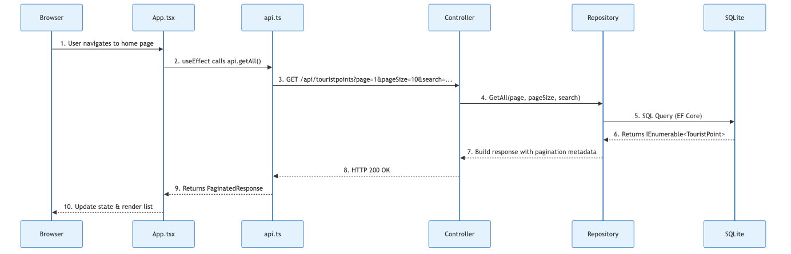
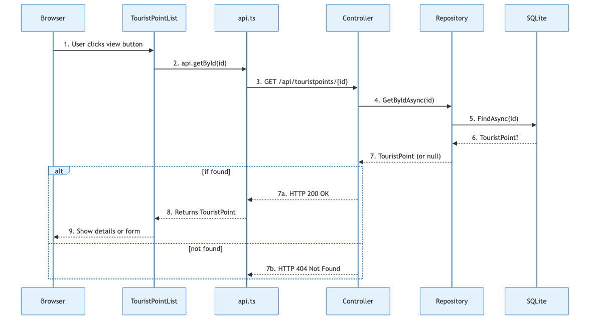
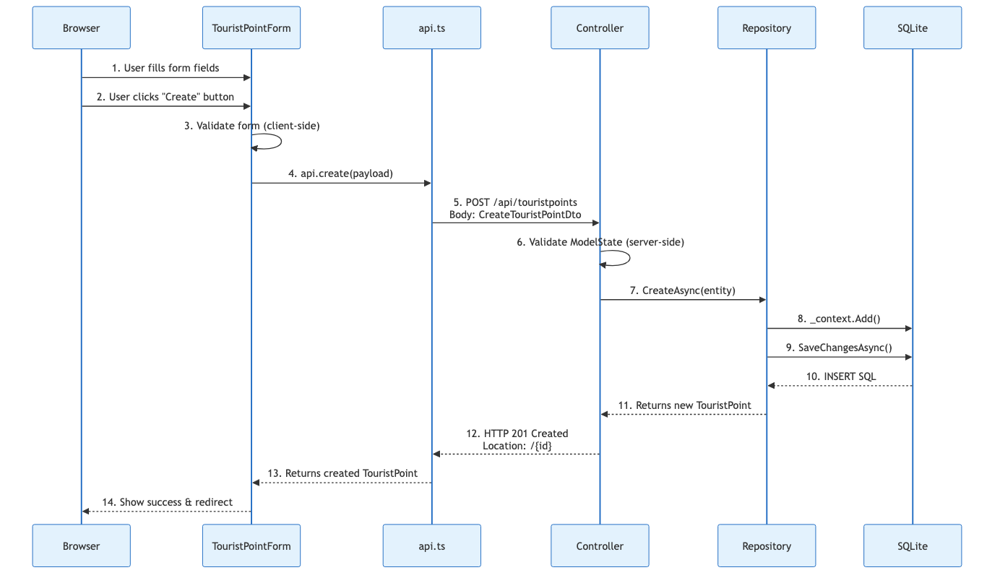
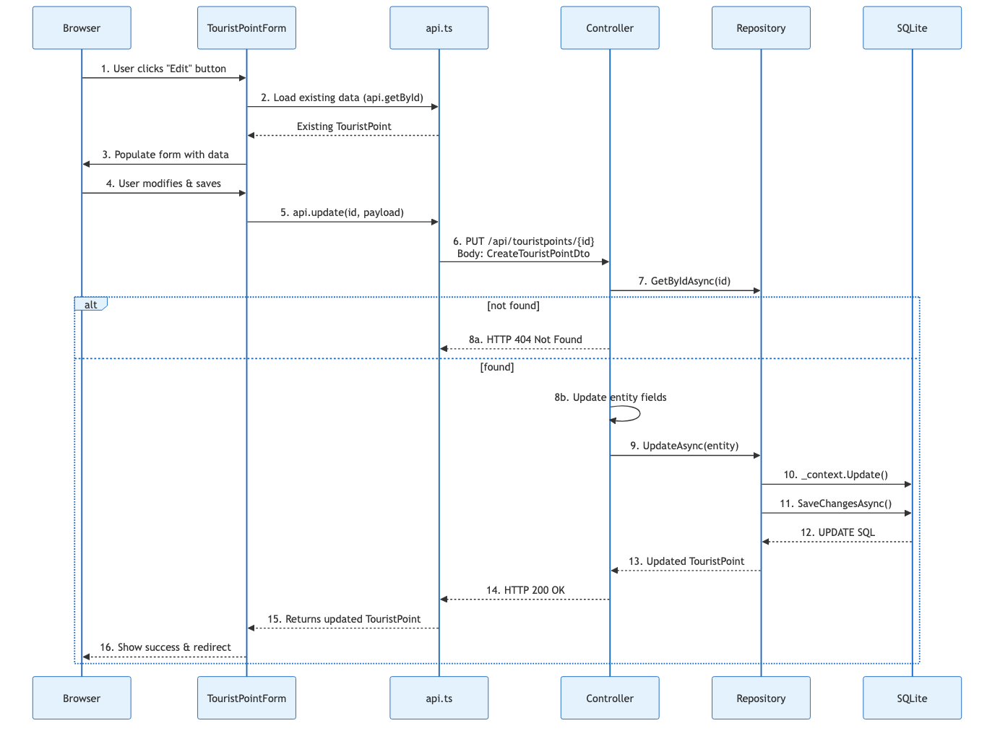
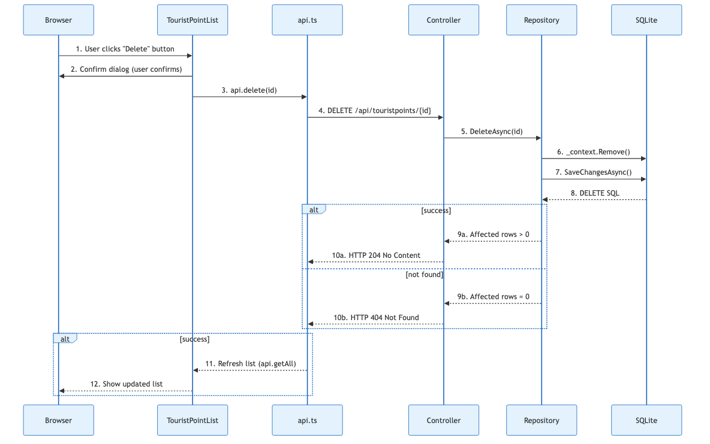

# Tourism Points - Architecture Documentation

## Table of Contents

1. [System Overview](#system-overview)
2. [Technology Stack](#technology-stack)
3. [Solution Structure](#solution-structure)
4. [System Architecture](#system-architecture)
5. [Sequence Diagrams](#sequence-diagrams)
6. [Data Models](#data-models)
7. [API Endpoints](#api-endpoints)
8. [Configuration](#configuration)
9. [Project Dependencies](#project-dependencies)

---

## System Overview

The **Tourism Points** (Portuguese: *Pontos Turísticos*) application is a full-stack web application for managing Brazilian tourist destinations. It provides a complete CRUD (Create, Read, Update, Delete) interface for tourist point records with the following features:

- **List tourist points** with pagination and search functionality
- **View individual tourist point** details
- **Create new** tourist point entries
- **Update existing** tourist point information
- **Delete** tourist point records
- **Auto-seeding** of 20 sample Brazilian tourist points on first run

### Architecture Pattern

The application follows a **Layered Architecture** with clear separation of concerns:



---

## Technology Stack

| Layer | Technology | Version |
|-------|------------|---------|
| **Frontend Framework** | React + Vite + TypeScript | React 18.x, Vite 6.x |
| **HTTP Client** | Axios | Latest |
| **Backend Framework** | ASP.NET Core | .NET 10 (net10.0) |
| **ORM** | Entity Framework Core | EF Core 10 |
| **Database** | SQLite | Bundled with EF Core |
| **Logging** | Serilog | Latest |
| **API Documentation** | Swagger/OpenAPI | Swashbuckle 7.2 |

---

## Solution Structure

```
tourism-points/
├── TourismPoints.slnx                  # Solution file (XML format)
├── README.md                          # Project documentation
├── ARCHITECTURE.md                    # This file
├── .gitignore
│
├── src/
│   ├── TourismPoints.API/             # ASP.NET Core Web API (Entry Point)
│   │   ├── Controllers/
│   │   │   └── TouristPointsController.cs      # REST API endpoints
│   │   ├── DTOs/
│   │   │   ├── CreateTouristPointDto.cs         # Input validation DTO
│   │   │   └── TouristPointDto.cs               # Output DTO
│   │   ├── ExceptionHandling/
│   │   │   └── GlobalExceptionHandler.cs        # Global exception handling
│   │   ├── Program.cs                            # Application configuration & DI
│   │   ├── TourismPoints.API.csproj
│   │   └── Properties/
│   │       └── launchSettings.json               # Port configuration (5151)
│   │
│   ├── TourismPoints.Domain/            # Domain Layer
│   │   ├── Entities/
│   │   │   └── TouristPoint.cs          # Core entity definition
│   │   └── TourismPoints.Domain.csproj
│   │
│   ├── TourismPoints.Infrastructure/    # Data Access Layer
│   │   ├── Context/
│   │   │   └── TourismDbContext.cs      # EF Core DbContext
│   │   ├── Repositories/
│   │   │   ├── ITouristPointRepository.cs     # Repository interface
│   │   │   └── TouristPointRepository.cs      # Repository implementation
│   │   ├── Data/
│   │   │   └── TourismDbSeeder.cs              # Seeds 20 sample tourist points
│   │   └── TourismPoints.Infrastructure.csproj
│   │
│   └── TourismPoints.Client/            # React Frontend
│       ├── src/
│       │   ├── components/
│       │   │   ├── TouristPointForm.tsx        # Create/Edit form
│       │   │   ├── TouristPointList.tsx        # List with pagination
│       │   │   ├── TouristPointHome.tsx        # Home page
│       │   │   ├── BrandLogo.tsx               # Logo component
│       │   │   └── BrowserWindow.tsx           # Layout wrapper
│       │   ├── services/
│       │   │   └── api.ts                      # API client (Axios)
│       │   ├── App.tsx                        # Main app component
│       │   ├── App.css                        # Styles
│       │   ├── index.css                      # Global styles
│       │   └── main.tsx                       # Entry point
│       ├── vite.config.ts                     # Vite config (port 5175)
│       └── package.json
│
└── tests/
    └── TourismPoints.Tests/              # Unit Tests
        ├── Controllers/
        │   └── TouristPointsControllerTests.cs
        ├── Repositories/
        │   └── TouristPointRepositoryTests.cs
        └── TourismPoints.Tests.csproj
```

---

## System Architecture

### Request/Response Flow



### Dependency Injection Configuration

The following services are registered in `Program.cs`:

```csharp
// Database
builder.Services.AddDbContext<TourismDbContext>(options =>
    options.UseSqlite("Data Source=tourism.db"));

// Repository Pattern
builder.Services.AddScoped<ITouristPointRepository, TouristPointRepository>();

// CORS Policy
builder.Services.AddCors(options =>
{
    options.AddPolicy("AllowReact", policy =>
    {
        policy.WithOrigins("http://localhost:5175")
            .AllowAnyMethod()
            .AllowAnyHeader();
    });
});
```

---

## Sequence Diagrams

### 1. Get All Tourist Points (with Pagination & Search)



### 2. Get Single Tourist Point



### 3. Create Tourist Point



### 4. Update Tourist Point



### 5. Delete Tourist Point



---

## Data Models

### TouristPoint Entity

Located in `TouristPoint.cs`:

```csharp
public class TouristPoint
{
    [Key]
    public int Id { get; set; }

    [Required]
    [MaxLength(100)]
    public string Name { get; set; } = string.Empty;

    [Required]
    [MaxLength(100)]
    public string Description { get; set; } = string.Empty;

    [Required]
    public string Location { get; set; } = string.Empty;

    [Required]
    public string City { get; set; } = string.Empty;

    [Required]
    [StringLength(2)]
    public string State { get; set; } = string.Empty;

    public DateTime CreatedAt { get; set; } = DateTime.UtcNow;
}
```

### DTOs

**CreateTouristPointDto** (Input):
```csharp
public class CreateTouristPointDto
{
    [Required]
    [MaxLength(100)]
    public string Name { get; set; } = string.Empty;

    [Required]
    [MaxLength(100)]
    public string Description { get; set; } = string.Empty;

    [Required]
    public string Location { get; set; } = string.Empty;

    [Required]
    public string City { get; set; } = string.Empty;

    [Required]
    [StringLength(2)]
    public string State { get; set; } = string.Empty;
}
```

**TouristPointDto** (Output):
```csharp
public class TouristPointDto
{
    public int Id { get; set; }
    public string Name { get; set; } = string.Empty;
    public string Description { get; set; } = string.Empty;
    public string Location { get; set; } = string.Empty;
    public string City { get; set; } = string.Empty;
    public string State { get; set; } = string.Empty;
    public DateTime CreatedAt { get; set; }
}
```

---

## API Endpoints

**Base URL:** `http://localhost:5151/api`

| Method | Endpoint | Description | Request Body | Response |
|--------|----------|-------------|--------------|----------|
| `GET` | `/api/touristpoints` | List all with pagination | Query: `page`, `pageSize`, `search` | `PaginatedResponse` |
| `GET` | `/api/touristpoints/{id}` | Get single by ID | - | `TouristPointDto` or 404 |
| `POST` | `/api/touristpoints` | Create new | `CreateTouristPointDto` | 201 Created |
| `PUT` | `/api/touristpoints/{id}` | Update existing | `CreateTouristPointDto` | `TouristPointDto` or 404 |
| `DELETE` | `/api/touristpoints/{id}` | Delete by ID | - | 204 No Content or 404 |

### Paginated Response Format

```json
{
  "items": [TouristPoint],
  "totalCount": 20,
  "page": 1,
  "pageSize": 10,
  "totalPages": 2
}
```

---

## Configuration

### Default Ports

| Service | Port | Configuration File |
|---------|------|-------------------|
| API HTTP | `5151` | `src/TourismPoints.API/Properties/launchSettings.json` |
| Frontend Dev | `5175` | `src/TourismPoints.Client/vite.config.ts` |
| Frontend HTTPS | `7161` | `src/TourismPoints.API/Properties/launchSettings.json` |

### CORS Configuration

The API is configured to accept requests from `http://localhost:5175` (frontend dev server). This is configured in `Program.cs`:

```csharp
builder.Services.AddCors(options =>
{
    options.AddPolicy("AllowReact", policy =>
    {
        policy.WithOrigins("http://localhost:5175")
            .AllowAnyMethod()
            .AllowAnyHeader();
    });
});
```

### Database

- **Engine:** SQLite
- **File Location:** `src/TourismPoints.API/tourism.db` (auto-created on first run)
- **Ignored by Git:** `.gitignore` contains `*.db` pattern

---

## Project Dependencies

### TourismPoints.API

```
Microsoft.EntityFrameworkCore.Sqlite 10.0.0
Serilog.AspNetCore 9.0.0
Serilog.Settings.Configuration 9.0.0
Serilog.Sinks.Console 6.0.0
Swashbuckle.AspNetCore 7.2.0
→ TourismPoints.Domain
→ TourismPoints.Infrastructure
```

### TourismPoints.Infrastructure

```
Microsoft.EntityFrameworkCore 10.0.0
Microsoft.EntityFrameworkCore.Sqlite 10.0.0
→ TourismPoints.Domain
```

### TourismPoints.Domain

No external dependencies (pure domain layer)

### TourismPoints.Client

```
react, react-dom (React 18.x)
axios (HTTP client)
typescript
vite (build tool)
```

---

*Document generated: 2026*
*Target Framework: .NET 10 (net10.0)*
*Architecture: Layered Architecture (API / Domain / Infrastructure)*
